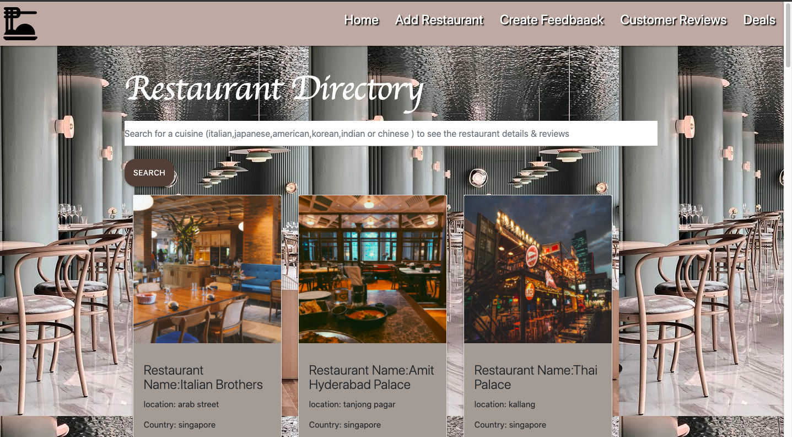

# About this site.

We were presented with a task to reflect what we have learned about Python and Flaskk and enabling CRUD
I took the opportunity to create an restaurant database search engine where users can search for restauraunts based on the the
type of cuisine (e.g Italian, chinese, japanese, american etc..).
Users are also able create feedback and have it displayed under Feedback page and have the ability to delete and update restaurant

# Demo 

# User Interface

# Programmig Language used
1. HTML
2. CSS
3. Python
4.Javascript

# Features
The overall website's look is achieved as planned. Users are able to search for restauraunts based on the cuisine type and able to update, delte abd create new restauraunts
and leave feedback

