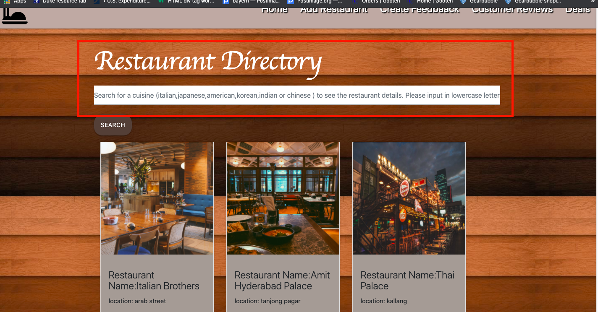
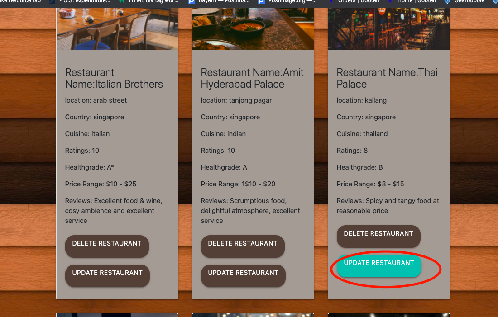
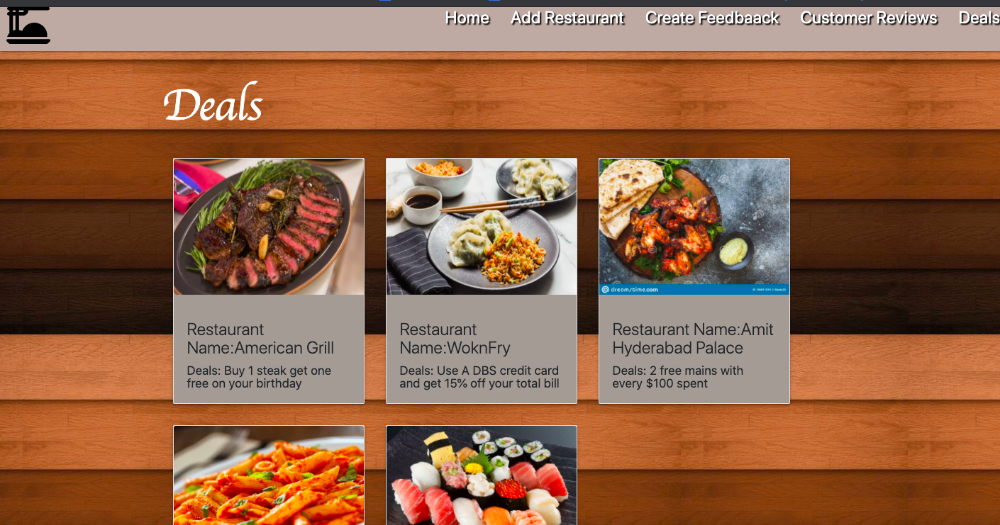
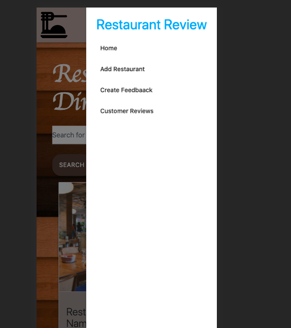

# About this site.

We were presented with a task to reflect what we have learned about Python and Flaskk and enabling CRUD functions.
I took the opportunity to create a restaurant database search engine where users can search for restauraunts based on the the
type of cuisine (e.g Italian, chinese, japanese, american etc..).
Users are also able create feedback and have it displayed under feedback page and have the ability to delete any restaurant
and update certain facts about a restaurant.
Users also have the ability to add new restaurants to the collection utilizing a create restaurant form.

# Demo 

A demo of the page can be seen [here](https://eatplaces.herokuapp.com/) on this link

# Programmig Language used
1. HTML
2. CSS
3. Python
4.Javascript

# Features

The overall website's look is achieved as planned. Users are able to search for restauraunts based on the cuisine type 
and able to update, delete, create new restaurauntsand leave a feedback.

# Features left to implement

The future plans for this wensite is to add a map so that users can actually see the locaion of the restaurants.
There are also plans to increase the restaurant database and make the site searchable by location and price range.

# Deployment

The website was deployed on Heroku and can be seen [here](https://eatplaces.herokuapp.com/)

Several steps were taken to ensure a smoooth Deployment
1) Debug was set to false

2) Heroku had to be installed in th bash terminal of Gitpod
(brew tap heroku/brew && brew install heroku)

3) Logging into Heroku was cried out after downloading Heroku,
heroku login -i

4) Requirements.txt also needed to be installed

5) A heroko app name was created.
heroku create <eatplaces>

6) gunicorn was installed so that my python application could return.
  pip3 install gunicorn

7) Created New remote

8) A Procfile had to be created. In the Procile, the following was inserted:
web gunicorn app:app

9) Finally all the new changes were pushed Validation
  git add .
  git commit -m "Commit messsage"
  git push heroku

# Content

All content was authored by me and referenced from pages which are mentioned in the Credit Section

# Media

Pictures for the home page were taken from
1. https://www.eatthis.com
2. https://www.today.com/
3. https://www.livejapan.com/
4. https://www.dreamstime.com/
5. https://purplecarrot.com/
6. https://www.archilovers.com
7. https://favicon.io/
8. https://unsplash.com/

# Credit

References,Javascript and bootstrap codes were used from the following websites

1. https://www.stackoverflow.com
2. https://www.w3schools.com
3. https://www.w3.org/
4. https://getbootstrap.com/
5. https://learn.codeinstitute.net/
6. https://materializecss.com/getting-started.html

# Page Structure Design 

<h2> ********** Layout and Design ********** </h2>

The page layout was designed with this deisgn originally as such using Adobe wireframe

The final outcome of the webpage was achieved as intended
The main content section will display the restaurant image and details in a card format

The database was created using MongoDB containing 3 collections

<h2> Testing & Operation</h2>

The navigation bar allows the user to easily navigate throughout the website.
the links and button changes in color when a mouse is hovered over them.
The user can perform restaurant deletion and update restaurant details.

the hover button function works as inteded.The links change color when a mouse hovers above it.

Users will be able to search for a restaurant by typing in the type of cuisine.

Searching by cusine will return to the user the restaaurants that serve the type of cuisine searched

Users will also be asked to confirm if they want to delete the restaurant

Users have the ability to add new restaurants to the collection

Users can also leave a feedback and see their feedback after submitting the form

Users are also able to update details on the restaurant.

Clicking on the deals tab will allow the users to see the current promotion for the different ,but not all restaurants.

Overall the C.R.U.D capibilities are in place and performs to expectation

<h2> Alert Messages </h2>

The user will be alerted with a flash message when 

1. Feedback is created

2. Restaurant has been deleted

3. New restaurant has created 

4. Restaurant has been updated

The website is responds well to different screen sizes. Images remain sharp and not squished.

Navigation bar transforms into a collapsible hamburger button and the side menu appears when the
hamburger button is clicked

<h2>  Validation  </h2>

An alert message will pop out when a user does not enter the name of the restaurant when he is creating a new restaurant

