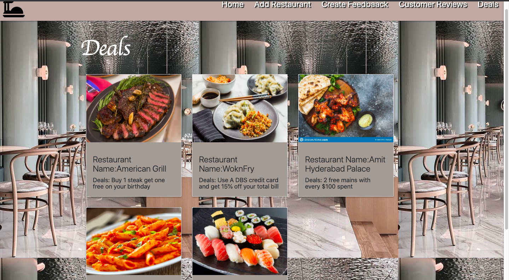

# About this site.

We were presented with a task to reflect what we have learned about Python and Flaskk and enabling CRUD
I took the opportunity to create an restaurant database search engine where users can search for restauraunts based on the the
type of cuisine (e.g Italian, chinese, japanese, american etc..).
Users are also able create feedback and have it displayed under Feedback page and have the ability to delete and update restaurant

# Demo 

# User Interface

# Programmig Language used
1. HTML
2. CSS
3. Python
4.Javascript

# Features

The overall website's look is achieved as planned. Users are able to search for restauraunts based on the cuisine type 
and able to update, delete, create new restaurauntsand leave a feedback.

# Features left to implement

The future plans for this wensite is to add a map so that users can actually see the locaion of the restaurants.
There are also plans to increase the restaurant database and make the site searchable by location and price range.

# Deployment

# Content

All content was authored by me and referenced from pages which are mentioned in the Credit Section

# Media

Pictures for the home page were taken from
1. https://www.eatthis.com
2. https://www.today.com/
3. https://www.livejapan.com/
4. https://www.dreamstime.com/
5. https://purplecarrot.com/
6. https://www.archilovers.com
7. https://favicon.io/
8. https://unsplash.com/

# Credit

References,Javascript and bootstrap codes were used from the following websites

1. https://www.stackoverflow.com
2. https://www.w3schools.com
3. https://www.w3.org/
4. https://getbootstrap.com/
5. https://learn.codeinstitute.net/
6. https://materializecss.com/getting-started.html

# Page Structure Design 

<h2> ********** Layout and Design ********** </h2>

The page layout was designed with this deisgn originally as such using Adobe wireframe

The final outcome of the webpage was achieved as intended
The main content section will display the restaurant image and details in a card format

The database was created using MongoDB containing 3 collections

<h2> ********** Testing & Operation ********** </h2>

The navigation bar allows the user to easily navigate throughout the website.
the links and button changes in color when a mouse is hovered above them.

Users will be able to search for a restaurant by typing in the type of cuisine.

Searching by cusine will return to the user the restaaurants that serve the type of cuisine searched

Users will also be allowed to delete and asked to confirm if they want to delete the restaurant

There is also a feature for the user to update the restaurant

Users can also leave a feedback and see their feedback after submitting the form

Clicking on the deals tab will allow the users to see the current promotion for the different ,but not all restaurants

